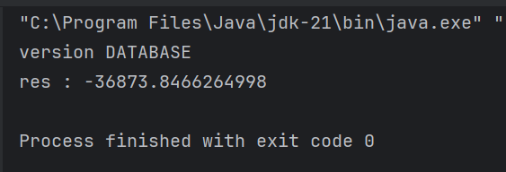
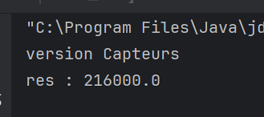

# Tp_InversionControle_JEE
Activité Pratique N°1 
<h2>Injectiond es dépendances et Inversion de contrôle</h2>

## Introduction

Ce projet vise à explorer les concepts d'Inversion de Contrôle (IoC) et d'Injection des Dépendances (DI) dans le développement logiciel. L'objectif principal est de comprendre comment ces principes peuvent améliorer la modularité, la flexibilité et la maintenabilité des applications.
L'architecture de projet :

# Rapport de Projet : Inversion de Contrôle et Injection des Dépendances

## Partie 1

1. **Interface `IDao`**:
   - Créer l'interface `IDao` avec la méthode `GetData()` pour accéder aux données.

2. **Implémentation de `IDao`**:
   - Implémenter l'interface `IDao` pour accéder aux données dans une classe concrète.

3. **Interface `IMetier`**:
   - Définir l'interface `IMetier` avec la méthode `calcul()` pour effectuer des calculs métier.

4. **Implémentation de `IMetier` avec Couplage Faible**:
   - Créer une implémentation de `IMetier` en utilisant un couplage faible pour favoriser la modularité et la réutilisabilité.

## Injection des Dépendances

1. **Injection par Instanciation Statique**:
   - Discuter des limitations de l'instanciation statique et de la modification fermée de la classe `Presentation`.

2. **Injection par Instanciation Dynamique**:
   - Introduire une approche configurable en lisant les noms de classe à partir d'un fichier `config.txt` pour permettre une flexibilité accrue.

<h2>Le resultats de DATABASE version</h2>

<h2>Le resultats Capteurs version</h2>

# Vous pouvez observez cette partie d'utilisation de Framework Spring est au niveau de la 2eme branche MASTER ainsi qu'il est un  projet gerer par maven

3. **Utilisation du Framework Spring**:
   - Utiliser le Framework Spring pour la gestion des dépendances.
   - Présenter deux approches : configuration XML et annotations, mettant en avant les avantages en termes de configuration et de testabilité.

## Conclusion

Ce projet a permis de comprendre l'importance de l'IoC et de l'Injection de Dépendances dans le développement logiciel moderne. En adoptant ces principes, les applications deviennent plus flexibles, modulaires et faciles à maintenir. L'utilisation de frameworks comme Spring facilite la mise en œuvre de ces concepts et contribue à améliorer la qualité du code.
Voici ci-joint le rapport :
https://docs.google.com/document/d/1m85Y2kXAKkIP01arEmOzQ1cLSJMJKdsx2x5nq_kVwWQ/edit?usp=sharing

