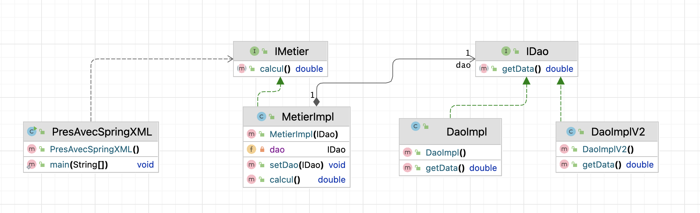

# Tp_InversionControle_JEE
Activité Pratique N°1 
<h2>Injectiond es dépendances et Inversion de contrôle</h2>

## Introduction

Ce projet vise à explorer les concepts d'Inversion de Contrôle (IoC) et d'Injection des Dépendances (DI) dans le développement logiciel. L'objectif principal est de comprendre comment ces principes peuvent améliorer la modularité, la flexibilité et la maintenabilité des applications.
L'architecture de projet :

# Rapport de Projet : Inversion de Contrôle et Injection des Dépendances

## Partie 2

# Vous pouvez observez cette partie d'utilisation de Framework Spring est au niveau de cette branche 

Voici ci-joint le rapport :
https://docs.google.com/document/d/1m85Y2kXAKkIP01arEmOzQ1cLSJMJKdsx2x5nq_kVwWQ/edit?usp=sharing

